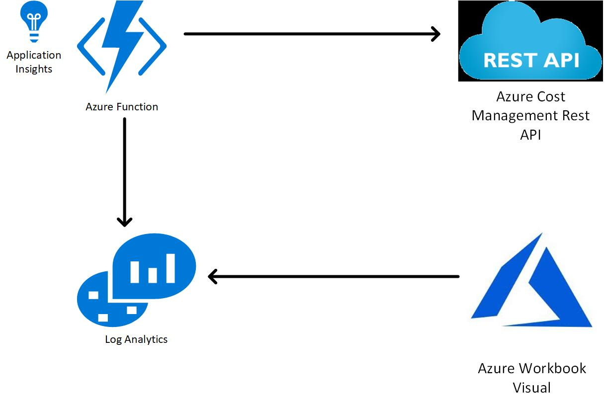

# AppService Deployments  

This repo will contain several examples of deploying an App Services. All of these deployments use nested deployments that are located in the [CSA Nested Template Repo](https://github.com/microsoft/CSANestedTemplates)  

## Table of Content  

* [Function Apps](#FunctionApps)
     - [Cost Data into Log Analytics](#CostLA)

# Function Apps  
Below we'll walk through some depoloyments that involve a Function Apps being deployed in Azure

## Function App to Ingest Azure Cost Data into Log Analytics  
Many customers would like to see Cost Anamolies that occcure in their Azure Environment. Currently that functionality isn't available in Azure Cost Management but if we were to ingest this data into Log Analytics we could use the build in Anamoly detection in the product. The below deployment will setup a function to ingest Azure Cost data into Log Analytics each day.  

This architecture is made of of the following resources:  
- Azure Function App with System Managed Identity   
- Azure Log Analytics    
- Azure Application Insights  
- Azure Storage Account  

  

### Deploy to Azure  

#### Post Deployment Steps    
After deploying this solution you have to give the App Service System Assigned Managed Identity "Read" permissons at the scope or scopes that you are quering.  The system assigned managed identity will have the same name as your function app.  

If you want to load historical data into Log Analytics you can utilize the function named **PreLoadLogAnalytics**.  

1) Get the function url by opening the Function and clicking on **Get Function URL**. Note that it may take a little bit to light up.  
2) At the end of the function url you need to add the number of days to load by appending **&days=30** 
3) Use a tool like PostMan or Curl to send the request. Below is an example using curl.

**curl 'https://poccostingestionfadhr2puxbmgliy.azurewebsites.net/api/PreLoadLogAnalytics?code=ichangedthisstring&days=30'**

#### Deploying Solution
Use the below link to deploy this solution to Azure. ***Note*** Make sure you follow the **Post Deployment Steps** after completing the deployment.

Only one parameter is required. The **deploymentPrefix** is used to name the resources deployed with a unique string appended to them:  

| Name       | Description     | Example     |
| :------------- | :----------: | -----------: |
|  deploymentPrefix | Prefix value for naming resources   | POC    |   

  

### Deployment Details  
Below are the details on the ARM Template used to deploy this solution. 

#### Log Analytics Workspace 
The data from Azure Cost API will be stored in this Log Analytics Workspace. So the first step in the template is to deploy the workspace.  

You can deploy Log Analytics using the following parameters:  

            "workspaceName": {
              "value": "[variables('laName')]"
            }

#### Application Insights  
We want to be able to monitor the Azure Function using Application Insights. So before we deploy our Azure Function we deploy Application Insights using the following properties:  
  
            "name": {
              "value": "[variables('appInsightsName')]"
            }  

#### Storage Account    
Azure Function store data on a storage account. So before we deploy our Azure Function we deploy a Storage Accoung using the following properties:  
  
            "saName": {
              "value": "[variables('saName')]"
            },
            "skuName": {
                "value": "Standard_LRS"
            },
            "skuTier": {
                "value": "Standard"
            }  

 
#### Azure Function   
Now that we have all the pre-reqs deployed we can deploy the Azure Function.  The most important part of this deployment is configuring the Application Settings.  

We pass in the Application Settings for the Function using an array formated like this:  

    [
        "name|value",
        "name|value"
    ]  

Below are the most important settings for our Function:    
    - AzureWebJobsStorage = connection string to the storage account  
    - AzureWebJobDashboard = connection string to the storage account  
    - WEBSITE_CONTENTAZUREFILECONNECTIONSTRING = connection string to the storage account  
    - WEBSITE_CONTENTSHARE = connection string to the storage account  
    - logName = Name of the log to be created in Log Analytics
    - scope = Comma seperated list of scope you want to query for Cost Data  
    - workspaceid = Log Analytics workspaceid to store the data  
    - workspacekey = Key for the log analytics workspace  
    - APPINSIGHTS_INSTRUMENTATIONKEY = Application Insights instrumentation key  

Below are the values we provide in the template:  

            "appName": {
              "value": "[variables('appName')]"
            },
            "appSettings": {
                "value": [
                    "[concat('AzureWebJobsStorage|',reference('deployStorageAccount').outputs.saConnectionString.value,'')]",
                    "[concat('AzureWebJobsDashboard|',reference('deployStorageAccount').outputs.saConnectionString.value,'')]",
                    "[concat('WEBSITE_CONTENTAZUREFILECONNECTIONSTRING|',reference('deployStorageAccount').outputs.saConnectionString.value,'')]",
                    "[concat('WEBSITE_CONTENTSHARE|', toLower(variables('appName')),'')]","FUNCTIONS_EXTENSION_VERSION|~3",
                    "WEBSITE_NODE_DEFAULT_VERSION|~10",
                    "FUNCTIONS_WORKER_RUNTIME|dotnet",
                    "WEBSITE_RUN_FROM_PACKAGE|0",
                    "logName|AzureCostAnamolies",
                    "scope|subscriptions/5f1c1322-cebc-4ea3-8779-fac7d666e18f",
                    "[concat('workspaceid|',reference('deployLogAnalytics').outputs.customerId.value,'')]",
                    "[concat('workspacekey|',reference('deployLogAnalytics').outputs.workspaceKey.value,'')]",
                    "[concat('APPINSIGHTS_INSTRUMENTATIONKEY|',reference('deployAppInsights').outputs.aiKey.value,'')]"
                ]
            }  

#### Deploy Code from GitHub     
The last step is to actually deploy our Azure Function. The code for this is sitting in this repo under the **AzureCost_to_LogAnalytics** folder. We can utilize the **WebAppSourceControl.json** template to deploy this using the below properties:  

            "appName": {
              "value": "[variables('appName')]"
            },
            "packageUri": {
                "value": "https://github.com/microsoft/CSAAppServiceDeployments.git"
            },
            "packageBranch": {
              "value": "main"
            }
